# Altlayer新一期Nitrogen测试网部署合约教程

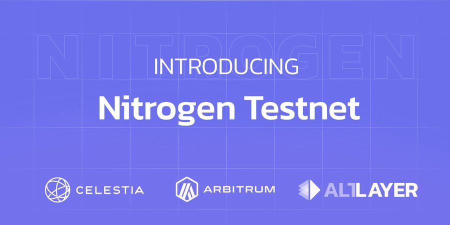

[Altlayer](https://twitter.com/alt_layer)推出了新一期的Nitrogen测试网，作为有潜力上币安的项目，值得多号去交互部署合约搏一搏，万一是下一个$XAI呢？

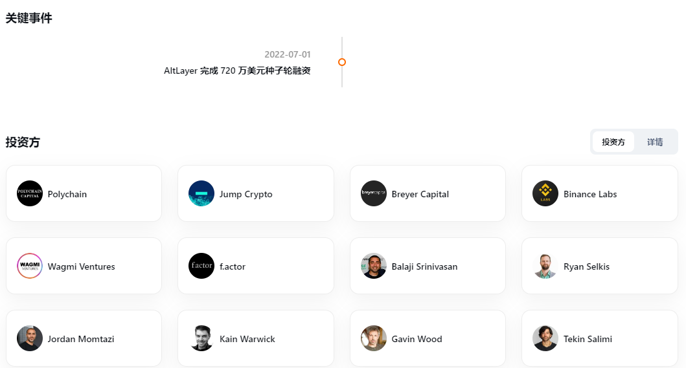

流程：

1. 添加Nitrogen测试网
2. 水龙头领水
3. 用thirdweb部署合约

官方文档：https://docs.altlayer.io/altlayer-documentation/external-integrations/nitrogen-orbit-celestia-testnet

Let's dive in👇

## 添加Nitrogen测试网

链接：https://rollup-info.altlayer.io/public/nitrogen

点击左下或右上连钱包

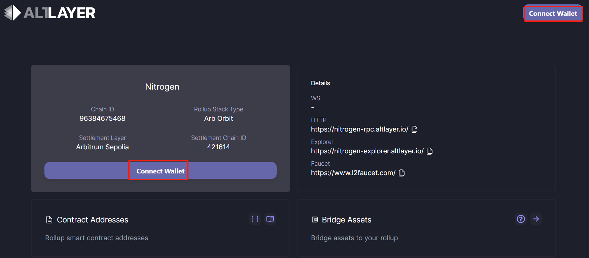

批准添加网络

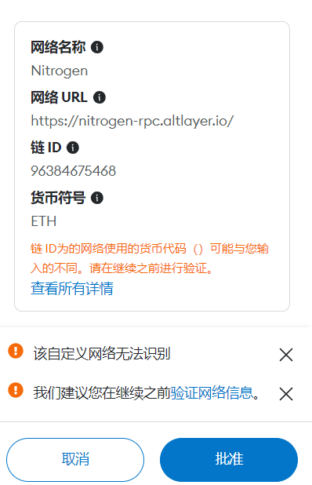

## 水龙头领水

链接：https://www.l2faucet.com/

点击select tokens

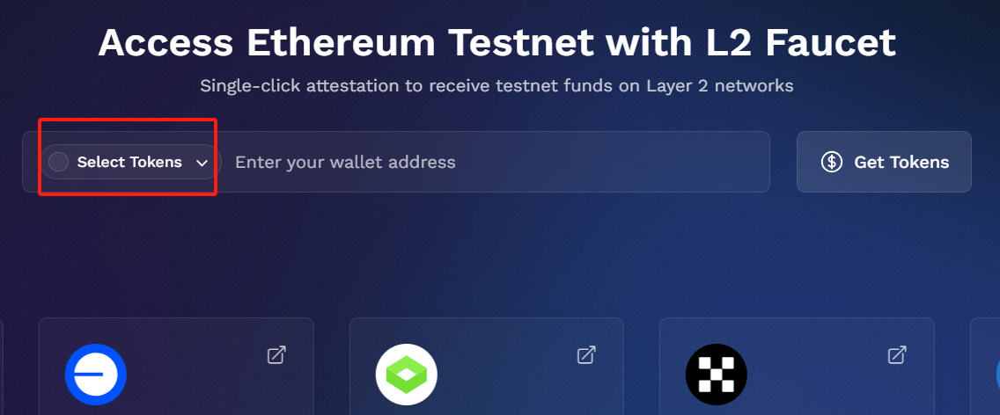

选择Nitrogen Testnet后，点击comfirm selection

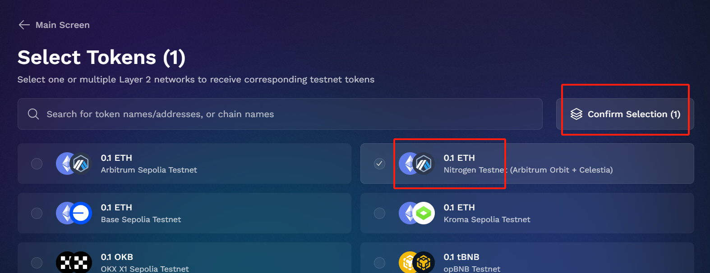

输入自己的钱包地址后，点击get tokens

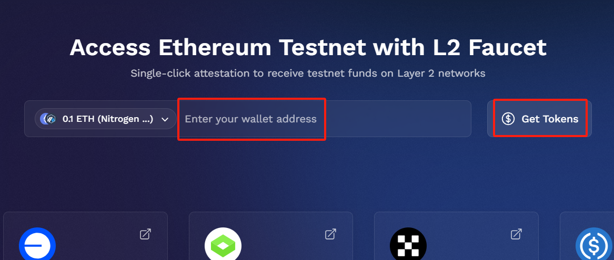

点击attest and get my tokens

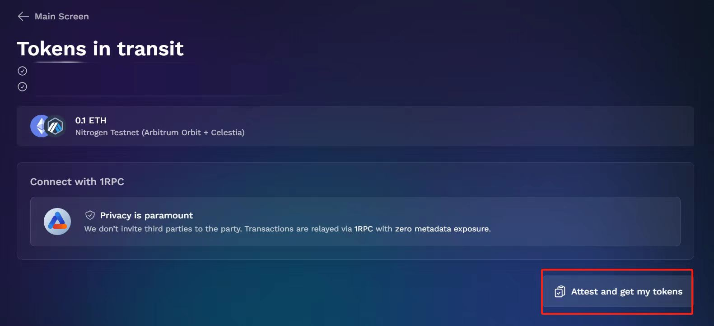

出现这一行字就是领水成功

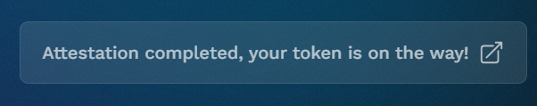

## 用thirdweb部署合约

链接：https://thirdweb.com/thirdweb.eth/TokenERC20

先点击右上角签名登录

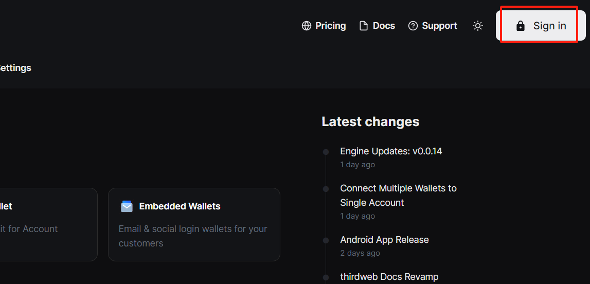

点击deploy now

需要手动输入Nitrogen网络，点击select network

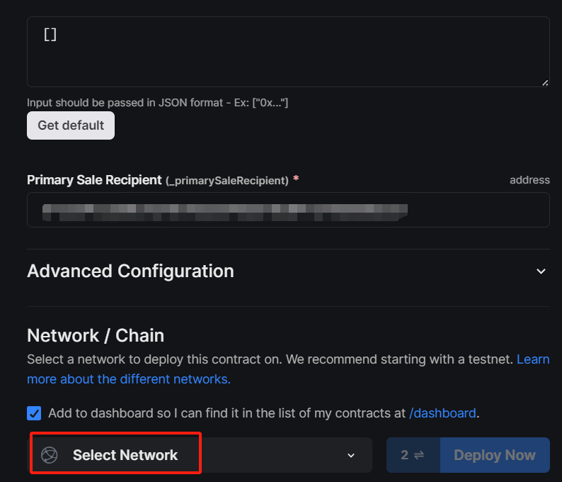

点击add custom network

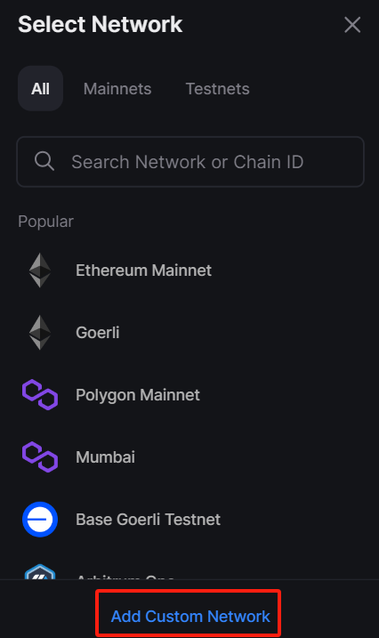

输入Nitrogen网络的参数

- Network name：Nitrogen
- Network ID：nitrogen
- Chain ID：96384675468
- Currency Symbol：ETH
- Network type：Testnet
- RPC URL：https://nitrogen-rpc.altlayer.io/

然后点击add network

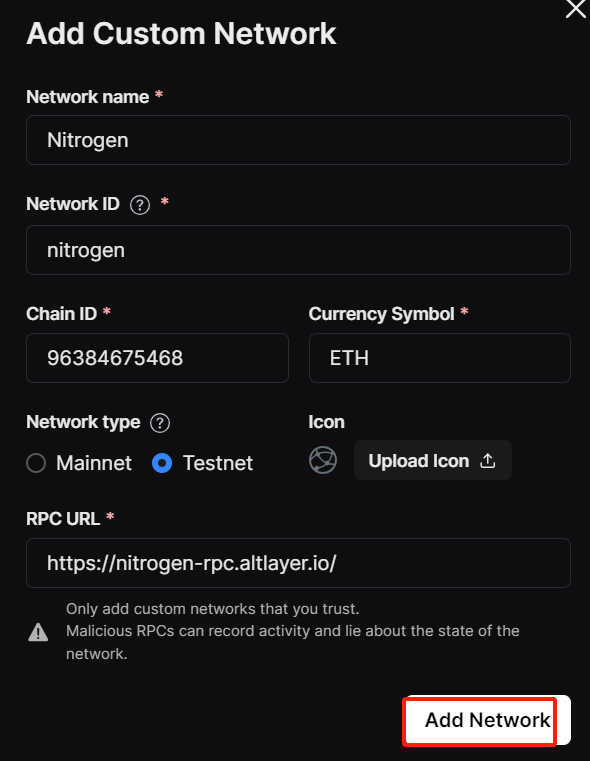

然后点击deploy now

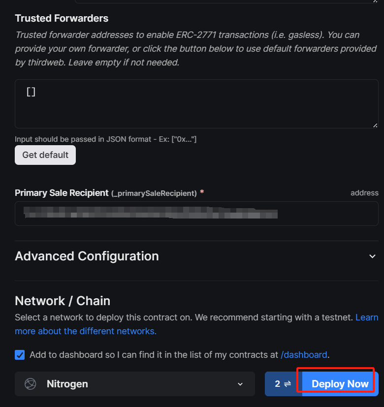

需要确认两次，就完成合约部署啦

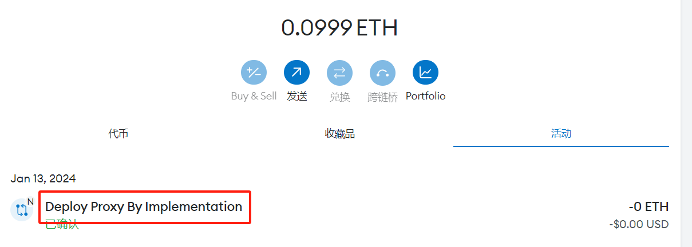

---

今天的教程到此结束，有新消息会在推特和教程里更新，有问题的也可以去推特DM我

[我的推特](https://twitter.com/_0xSeaside_): [https://twitter.com/\_0xSeaside\_](https://twitter.com/_0xSeaside_)

撸毛是持久战，需要付出耐心和体力，祝大家都能一夜暴富