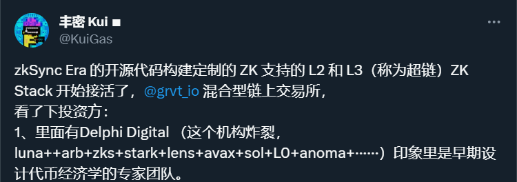
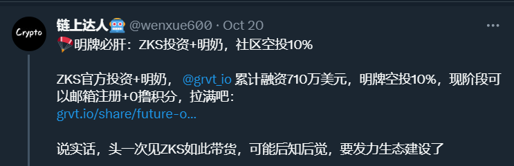
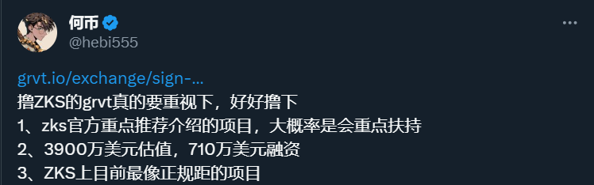
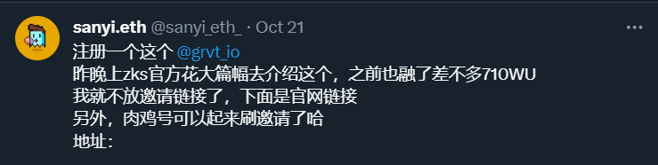
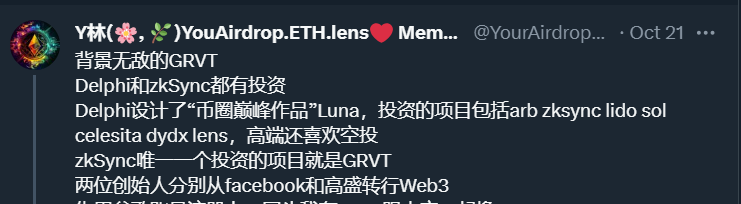
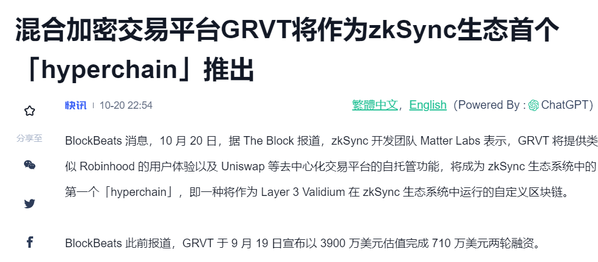

如果说3、4月份由于空投狂热情绪引发的zks上出现的是各种群友创业盘，那么现在的GRVT可以说是zks上官方扶持的原生正规军

先说结论——必撸

传送门：https://grvt.io/exchange/sign-up?ref=0R2DIJC

接下来我会从多个方面分析这个项目：

## 豪华融资背景

- Pre种子轮210万，机构包含500 Startups、Folius Ventures
- 种子轮500万，Matrix Partners和Delphi Digital领投，ABCDE Capital、Hack VC、Matter Labs（zkSync开发商）、Metalpha、C² Ventures等参投

这样的融资历程是非常健康且真实的，反观某些项目一上来种子轮就融了2000w，基本上是开了10倍杠杆

## zks官方扶持

zks mirror原文链接：https://zksync.mirror.xyz/8qNtXFBTN8iVqG3qyWXmjmT9f4VGvDNw2FOb4ikBB_0

从这篇文章中我们可以归纳出zkSync Hyperchain 与 GRVT之间的关系：

1. zkSync Hyperchain是zksync推出的首个应用链

这是由ZK Stack作为核心的一个大动作，ZK Stack跟OP Stack类似，是一个提供给其他项目方的发链技术栈，开发者可以使用ZK Stack一键发链

目前使用OP Stack发链的链非常多，包括base、mantle、opbnb，因此OP Stack是目前最好用的发链工具

zkSync团队也意识到当前的劣势，想从发链技术栈这个市场中夺回蛋糕绝非易事

2. GRVT是一种加密货币衍生品交易所，是首个由ZK Stack提供技术支持的产品

既然是首个产品，那必然是要当成亲儿子培养起来，不仅要抢占衍生品交易市场份额，更是要起到使用ZK Stack发链的示范效应

因此zks官方不仅参与了融资，还写了一篇mirror，发了官推，给予流量扶持

## 舍得花钱营销

这一点怎么看出来的？看下面几张图

一般的项目只会有一两个几万粉的大V发推，而这个项目能让这么多的大V都发推，大概率是买的

同时还买了律动的一篇PR稿

舍得花这么多钱营销拉人头，可以看出创始人想用心做项目

## 总结

融资历程健康且真实、得到zks官方扶持、舍得花钱营销、定位衍生品赛道的GRVT必撸

空投份额10%，现在可以加入成为早期大使并获得积分，积分应该用于兑换未来的token，类似于blur

注册链接：https://grvt.io/exchange/sign-up?ref=0R2DIJC

-----

今天的介绍到此结束，有新消息会在推特和教程里更新，有问题的也可以去推特DM我

[我的推特](https://twitter.com/0xSeaside888): [https://twitter.com/0xSeaside888](https://twitter.com/0xSeaside888)