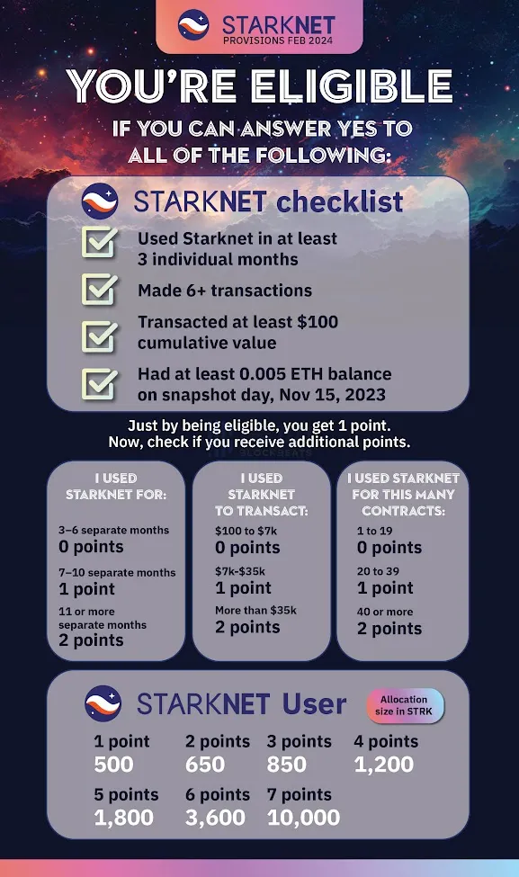
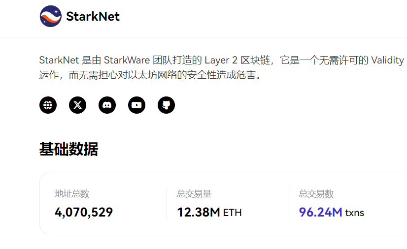
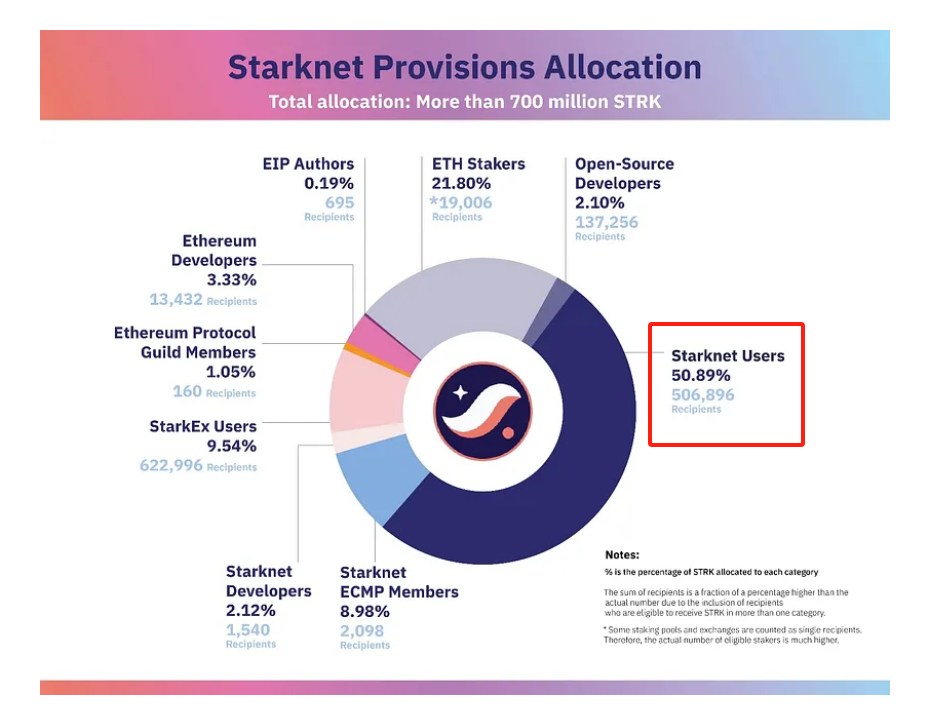

官方规则链接：https://medium.com/@StarknetFoundation/introducing-the-starknet-provisions-program-05d03ce13970

## wen?now!

starknet启动第一轮空投，在这一轮计划中，基金会将向近130万个地址分配超过7亿STRK。这是专用于Provisions计划的9亿STRK的一部分（总共有18亿STRK专用于社区）

2024年2月20日中午12点(UTC)开始申领，持续4个月

## 空投资格用户

与普通用户相关的有以下几条：

### 交互用户

基本条件：

1. 2023年11月15日之前总共进行了五次以上的交易
2. 活跃时间在三个月以上
3. 交易量在100美元以上
4. 2023年11月15日其账户中拥有0.005ETH或更多

满足以上条件就有1分

积分规则：

### 早期社区成员

通过早期社区成员计划（ECMP）的社区成员有资格

### StarkEx用户

所有在2022年6月1日之前进行过至少八次交易的StarkEx用户都有资格

<!-- ### 以太坊贡献者

#### 以太坊协议工会成员

2023年11月15日的所有协议公会成员都有资格（线性解锁）

#### 以太坊开发者

所有开发者，只要在2023年11月15日之前至少有三次提交，且在2018年1月1日至2023年11月15日期间至少有一次提交，并被Electric Capital的《区块链开发者报告》认定为属于以太坊生态系统的GitHub存储库，且其GitHub资料可通过GitHub API从其电子邮件中提取，均有资格

#### EIP 作者

在2023年11月15日之前使用其GitHub handle发布提案的 EIP（包括 ERC）作者和合著者，其 GitHub 简介可通过 GitHub API 从其电子邮件中提取

#### ETH 质押者

所有在合并（2022 年 9 月 15 日）之前使用以太坊的权益证明（PoS）模式投注 ETH 的用户都有资格

### 开源开发者

在 2023 年 11 月 15 日之前至少提交过三次，并且在 2018 年 1 月 1 日至 2023 年 11 月 15 日期间至少提交过一次，参与了 GitHub 前 5000 个项目之一（按 GitHub 星级排名），且其 GitHub 资料可通过 GitHub API 从其电子邮件中提取的开发者，均有资格获得 Provisions -->

## 后续要注意的点

1. 链上留存只能留e，不要留u或去做lp，因为项目方最后统计地址留存的时候e的数据是最容易获取的，你方便别人别人也方便你
2. 交互时间、金额、顺序、内容一定要打乱，也不要去做奥德赛，行为容易与别人类似
3. 低保号/数据差的号不一定没空投，只要能通过女巫检测就成功了

斯塔克总共400w地址，杀了350w，最后剩下50w交互地址有资格，也就是说就算你的号数据做的再好，通不过女巫检测也是给别人的低保号抬轿子

