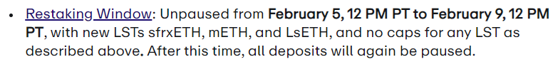
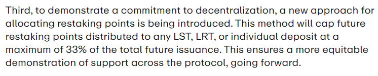
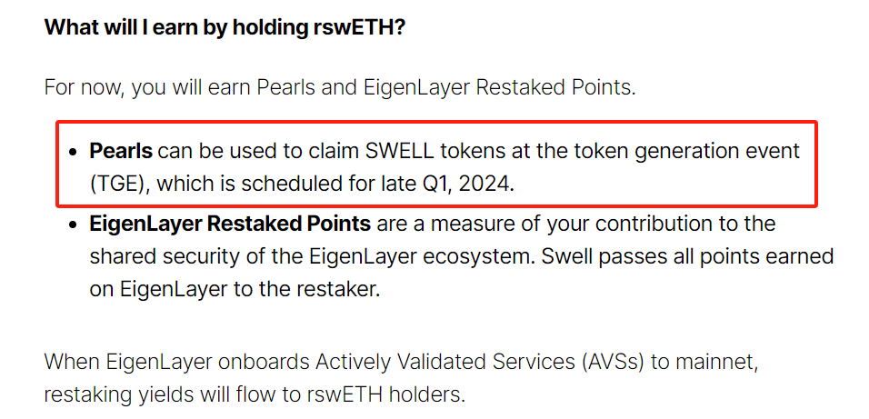
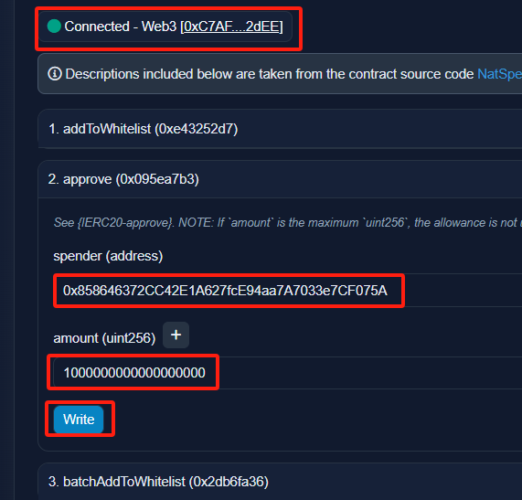

## 规则

官方规则链接：https://www.blog.eigenlayer.xyz/update-on-upcoming-lst-additions-and-restaking-unpause/

1. 质押时间2月6日4点——2月10日4点(UTC+8)

每个池子不设上限，因此不用熬夜存钱，四天内找个gas低的时候存进去即可

2. 尽量往TVL低的池子存

新规则规定分配给每个池子的积分最多不得超过今后发放总量的33%

## 策略

我的策略是存swETH

### 逻辑

1. 能吃到swell的珍珠同时与eigenlayer直接交互赚积分
2. swell Q1发币，可能是LRT赛道里最快收菜的项目

### 目前可以做的准备

1. 去swell官网质押ETH获得swETH

传送门：https://app.swellnetwork.io?ref=0xc7af21c54344ecd042c40286b05bd64bd8612dee

2. 提前授权（这一步自己把握不住请到时候在官网授权，如果发生资金损失本人**不负责**）

来到[swETH合约](https://etherscan.io/address/0xf951e335afb289353dc249e82926178eac7ded78#writeProxyContract#F2)

第一个空输入合约地址：0x858646372CC42E1A627fcE94aa7A7033e7CF075A

这是EigenLayer: Strategy Manager合约

第二个空随便输入一个数字，之后可以在钱包弹窗修改，如果输入1000000000000000000，就是1swETH

---

之后在质押时间内去[官网质押](https://app.eigenlayer.xyz/token/swETH)