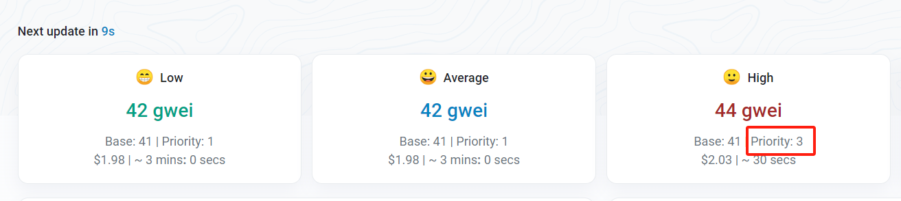

铭文生态日益火爆，科学家已经上脚本all in了，你还在一个个手搓交易？

别焦虑，看完这篇教程，小白也可以掌握科技的力量

教程参考：https://twitter.com/Daniel_eth2 大佬

本教程分为两个脚本，一个是无id铭文，一个是有id铭文

# 无id铭文脚本

## 准备工作

1. 安装python环境：https://www.python.org/downloads/

2. 导入web3官方包

```
pip install web3
```

## 如何使用

```python
private_key = "填写钱包私钥"
recipient_address = "填写接受钱包地址" #一般填自己的
data = 'data:,{"p":"erc-20","op":"mint","tick":"eths","amt":"1000"}'
rpc_map = {
    'mainnet': '填写rpc链接',
}
```

1. 实际使用中需要根据不同链的情况修改data 
2. rpc可以去alchemy或者infura申请

## 完整代码

```python
from web3 import Web3, HTTPProvider, Account
from web3.middleware import geth_poa_middleware

private_key = "填写钱包私钥"
recipient_address = "填写接受钱包地址" #一般填自己的
data = 'data:,{"p":"erc-20","op":"mint","tick":"eths","amt":"1000"}'
rpc_map = {
    'mainnet': '填写rpc链接',
}

def get_transaction_eip1559(rpc_url, text_data, priority_fee):
    web3 = Web3(HTTPProvider(rpc_url))
    web3.middleware_onion.inject(geth_poa_middleware, layer=0)  # Inject POA middleware
    # Check if connected to Ethereum network
    if not web3.is_connected():
        raise Exception("Not connected to Ethereum network")
    # Set up the sender's account
    sender_account = Account.from_key(private_key)
    sender_address = sender_account.address

    # Transaction details
    value = web3.to_wei(0, 'ether')
    # Get the nonce for the sender's account
    nonce = web3.eth.get_transaction_count(sender_address, 'pending')
    base_fee = web3.eth.get_block('latest')['baseFeePerGas']

    # Transaction details
    max_priority_fee_per_gas = web3.to_wei(priority_fee, 'gwei')  
    max_fee_per_gas = base_fee + max_priority_fee_per_gas
    # EIP-1559 transaction parameters

    # Convert data to hex and add as data to the transaction
    data_hex = web3.to_hex(text=text_data)

    # Estimate gas limit for the transaction
    gas_estimate = web3.eth.estimate_gas({
        'to': recipient_address,
        'value': value,
        'from': sender_address,
        'data': data_hex
    })

    transaction = {
        'type': '0x2',  # Indicates an EIP-1559 transaction
        'chainId': web3.eth.chain_id,
        'nonce': nonce,
        'maxPriorityFeePerGas': max_priority_fee_per_gas,
        'maxFeePerGas': max_fee_per_gas,
        'gas': gas_estimate+10000,
        'to': recipient_address,
        'value': value,
        'data': data_hex
    }
    print(f"Transaction: {transaction}")
    return transaction, web3, private_key, nonce

def signed_send(transaction, web3, private_key, is_wait=True):
    # Sign the transaction
    signed_tx = web3.eth.account.sign_transaction(transaction, private_key)
    # Send the transaction
    tx_hash = web3.eth.send_raw_transaction(signed_tx.rawTransaction)
    # Get the transaction hash
    print(f"Transaction hash: {tx_hash.hex()}")
    # Wait for the transaction receipt (optional)
    if is_wait:
        tx_receipt = web3.eth.wait_for_transaction_receipt(tx_hash)
        print(f"Transaction receipt: {tx_receipt}")
        print(f"Transaction status: {tx_receipt['status']}")

def send_transaction(number, rpc, test_data, is_wait=True, priority_fee=10):
    transaction, web3, private_key, nonce = get_transaction_eip1559(rpc, test_data, priority_fee)
    for i in range(number):
        transaction.update({'nonce': nonce})
        signed_send(transaction, web3, private_key, is_wait)
        nonce = nonce + 1


if __name__ == '__main__':
    send_transaction(10, rpc_map.get("mainnet"), data, is_wait=False, priority_fee=20)
```

**说明**：使用时只需要修改最后一行代码即可，“10”可以改成你一次运行想打的次数，is_wait为True就是等上一笔完成后再打，为False就是一直打，priority_fee要根据实际情况填写

例如下面这张图，Priority是3，那你就得写4或5



# 有id铭文脚本

## 完整代码

```python
from web3 import Web3, HTTPProvider, Account
from web3.middleware import geth_poa_middleware

private_key = "填写钱包私钥"
recipient_address = "填写接受钱包地址" #一般填自己的
data = 'data:,{"p":"erc-20","op":"mint","tick":"eths","amt":"1000"}'
rpc_map = {
    'mainnet': '填写rpc链接',
}

def get_transaction_eip1559(rpc_url, text_data, priority_fee):
    web3 = Web3(HTTPProvider(rpc_url))
    web3.middleware_onion.inject(geth_poa_middleware, layer=0)  # Inject POA middleware
    # Check if connected to Ethereum network
    if not web3.is_connected():
        raise Exception("Not connected to Ethereum network")
    # Set up the sender's account
    sender_account = Account.from_key(private_key)
    sender_address = sender_account.address

    # Transaction details
    value = web3.to_wei(0, 'ether')
    # Get the nonce for the sender's account
    nonce = web3.eth.get_transaction_count(sender_address, 'pending')
    base_fee = web3.eth.get_block('latest')['baseFeePerGas']

    # Transaction details
    max_priority_fee_per_gas = web3.to_wei(priority_fee, 'gwei')
    max_fee_per_gas = base_fee + max_priority_fee_per_gas
    # EIP-1559 transaction parameters

    # Convert data to hex and add as data to the transaction
    data_hex = web3.to_hex(text=text_data)

    # Estimate gas limit for the transaction
    gas_estimate = web3.eth.estimate_gas({
        'to': recipient_address,
        'value': value,
        'from': sender_address,
        'data': data_hex
    })

    transaction = {
        'type': '0x2',  # Indicates an EIP-1559 transaction
        'chainId': web3.eth.chain_id,
        'nonce': nonce,
        'maxPriorityFeePerGas': max_priority_fee_per_gas,
        'maxFeePerGas': max_fee_per_gas,
        'gas': gas_estimate+10000,
        'to': recipient_address,
        'value': value,
        'data': data_hex
    }
    print(f"Transaction: {transaction}")
    return transaction, web3, private_key, nonce

def signed_send(transaction, web3, private_key, is_wait=True):
    # Sign the transaction
    signed_tx = web3.eth.account.sign_transaction(transaction, private_key)
    # Send the transaction
    tx_hash = web3.eth.send_raw_transaction(signed_tx.rawTransaction)
    # Get the transaction hash
    print(f"Transaction hash: {tx_hash.hex()}")
    # Wait for the transaction receipt (optional)
    if is_wait:
        tx_receipt = web3.eth.wait_for_transaction_receipt(tx_hash)
        print(f"Transaction receipt: {tx_receipt}")
        print(f"Transaction status: {tx_receipt['status']}")

def send_transaction(number, rpc, test_data, is_wait=True, priority_fee=10, first=1):
    transaction, web3, private_key, nonce = get_transaction_eip1559(rpc, test_data, priority_fee)
    for i in range(number):
        current_id = first + i
        # 构建每笔交易的 data，包含新的 id
        modified_data = test_data.replace('"amt":"1000"', f'"id":"{current_id}","amt":"1000"')
        transaction.update({'nonce': nonce, 'data': web3.to_hex(text=modified_data)})
        signed_send(transaction, web3, private_key, is_wait)
        nonce += 1


if __name__ == '__main__':
    # 使用示例
    send_transaction(10, rpc_map.get("mainnet"), data, is_wait=False, priority_fee=20, first=1000)
```

**说明**：有id铭文脚本跟无id的差不多，在使用时只需要多修改一个first参数，它的作用是决定了起始id，例如在上面这个例子中，会打出id从1000到1009的铭文