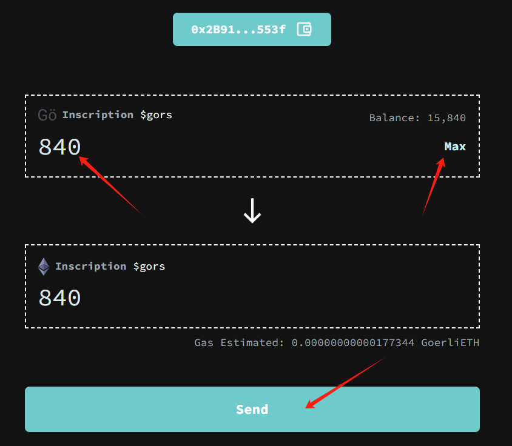
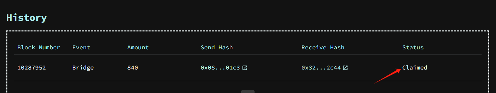
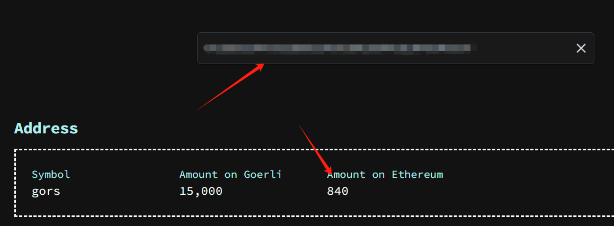

<!-- import HexConverter from './js/HexConverter.js'

<HexConverter /> -->
## 进入官网

https://goerlis.io/bridge

## 连钱包

## 输入数量并跨链

可以手动输入，也可以点击右边的`MAX`直接把所有的`$gors`都跨过去，然后点击下面的`send`

## 确认跨链交易

gas选激进型，反正不要钱，防止卡链

## 在ETH主网上领取

需要大约等待1分钟左右，跨链交易才会被确认，然后点击`claim`，在主网上发送交易签收

## 检查是否成功

页面拉到下方，`status`如果变成Claimed就是成功（大约需要5分钟确认）

同时可以去索引查看：https://goerlis.io/explorer

在方框内输入自己的地址，下方就会出现Goerli和主网的数量

可以看到我的84张 $gors 已经成功跨到主网上了！

