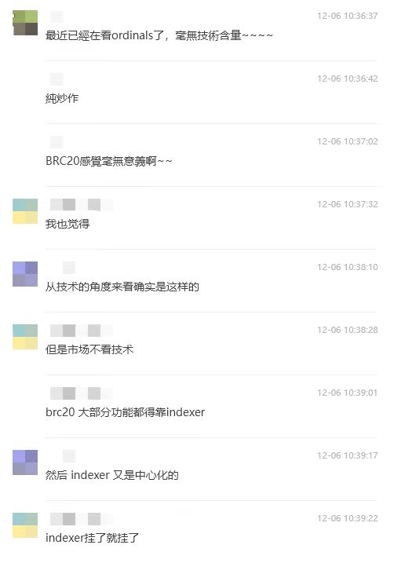
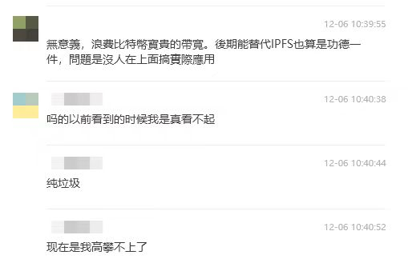
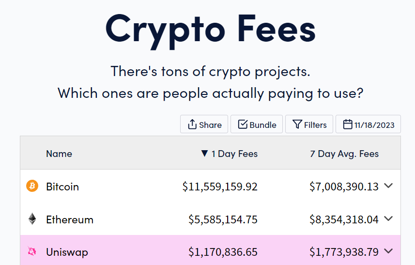
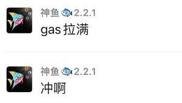
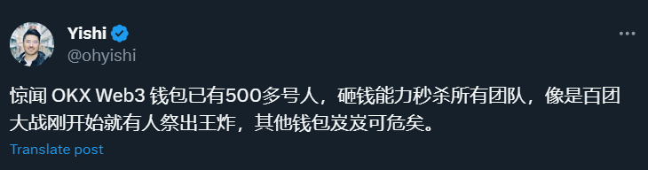

## 要想暴富，利益和技术，哪个更重要？

早上在技术交流群里面看到这样的对话

大意是铭文就是一坨屎，既无技术含量，还浪费比特币的带宽

我认为这些朋友陷入了一个思维误区，技术好坏跟铭文的价格根本没关系，那跟什么有关系？

跟**庄家的利益**有关系

## 明确区块链价值

首先学习一下 Seaside 第一定律：

区块链目前就两个价值：

1. 24小时不间断的赌场
2. 洗钱

除此之外毫无任何价值

那为什么标的价格能上涨呢？是因为有庄家在操盘做局

## 你是项目方？是交易所？还是散户？

圈内大致可以分为三种人：

1. 项目方
2. 交易所
3. 散户

而在铭文这个庞氏里，项目方可以等价成矿老板

我们来分析一下，铭文暴富对这三类人有什么影响？

1. 矿老板

因为铭文，比特币网络交易费用三年来首次超过以太坊，费用上涨了200倍

印钞机人称小矿机

这还没到牛市，就已经赚麻了，到了牛市怎么样想都不敢想

2. 交易所

交易所和链上比交易更快，更丝滑，因此交易所可以从链上的交易费用市场分一杯羹，这是其一

更重要的是可以培养自己的web3钱包用户，在这一块做得最好的是ok

上半年brc20玩家还在用unisat钱包，而现在基本上都在用ok web3钱包，ok通过brc20成功吸引了一大批钱包用户，在钱包领域已经占据主导

ok对钱包团队倾注更多的投资也相当于是在给自己看好的项目**加仓**

3. 散户

读懂庄家意思的散户抓住了这次逆天改命的机会，3月8日晚上mint一张成本不到5U，现在60000U一张

理智的散户认清铭文毫无技术含量的事实，最终收获了智慧

## 总结

因此，无论是矿老板还是交易所，都有自己的利益需求去打造一个铭文暴富神话

技术重要吗？不重要，重要的是这个事物符不符合庄家的利益、资本的利益

写这篇文章目的时刻提醒自己抛弃傲慢与偏见，质疑庄家、理解庄家、成为庄家

同时也希望和大家在下一轮牛市找到下一个逆天改命的机会